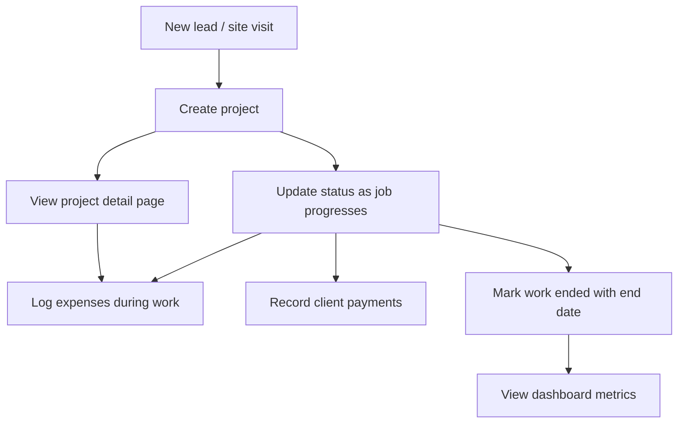

# Product Overview

## What is Skyline-App?

Skyline-App is an internal web tool for **Skyline Constructions** to manage construction jobs from initial site visit through completion. Staff can:

- Create and track **projects** with client details, quoted amounts, and a status pipeline
- Log **expenses** against projects
- Record **payments** received from clients
- View a **dashboard** with project counts, revenue metrics, and cash-flow charts

There is no custom backend server. The browser talks directly to Supabase (PostgreSQL via PostgREST).

---

## Target users

**Construction office staff** — project managers, accountants, or owners who need a lightweight CRM + ledger for active jobs.

**Current access model:** No login screen. Anyone with the app URL and a valid Supabase anon key can read and write all data. Treat this as a single-tenant internal tool on a trusted network, not a public multi-user product.

---

## Core entities

### Project

A client construction job. Tracks:

- Identity: title, client name, location, work description
- Pipeline: status (site visit → quotation → work → completion or rejection)
- Progress: completion percentage, start/end dates
- Finances: total quoted amount, amount received (manual field), derived pending balance

### Expense

A cost incurred on a project (materials, labor, subcontractor, etc.). Always linked to one project via `project_id`.

### Payment

Money received from a client for a project. Always linked to one project via `project_id`. Stored separately from `projects.amount_received` (see known gap below).

---

## User journeys

1. **Onboard a job** — Projects page → fill Add New Project form → project appears in table
2. **Track progress** — Edit project → change status, dates, completion %
3. **Record costs** — Expenses page → select project, enter amount and date
4. **Record income** — Payments page or inline in Edit Project modal
5. **Review performance** — Dashboard → active count, completed revenue, cash-flow charts
6. **Drill into a job** — Click project title → detail page with financials and expense list

---

## In scope (current version)

- CRUD for projects (create, read, update — no delete)
- Create and list expenses
- Create and list payments
- Dashboard with 4 metric cards and 2 bar charts
- Project detail view
- Status badges and color coding
- Responsive sidebar layout

---

## Out of scope (current version)

| Feature | Notes |
|---------|-------|
| Authentication / roles | No Supabase Auth integration |
| Edit/delete expenses | Insert + list only |
| Edit/delete payments | Insert + list only |
| Invoicing / PDF export | Not implemented |
| File uploads (photos, contracts) | Not implemented |
| Scheduling / calendar | Not implemented |
| Notifications / email | Not implemented |
| Mobile native app | Web only |
| Multi-currency | Hardcoded `$` display |
| Audit log | Not implemented |

---

## Production deployment

**Intended URL:** `https://skylineconstructions.in/app/`

The app is deployed as a static SPA under the `/app/` subpath. See [07-deployment.md](./07-deployment.md) for required Vite and router configuration.

---

## Known product gaps

Document these when replicating so you can choose to preserve or fix behavior:

1. **Payments vs `amount_received`** — Recording a payment inserts into `payments` but does not update `projects.amount_received`. Pending balances in the project table can become stale unless manually set at project creation.

2. **Status inconsistency** — Add form uses `work ended`; update form also offers `Completed` (capital C). Dashboard logic only recognizes `work ended`.

3. **Misleading "Profit" label** — Dashboard "Profit" sums quoted amounts for completed jobs, not net margin (income minus expenses).

4. **No error states** — Missing projects show an infinite loading spinner; most forms log errors to console only.

5. **No auth** — Suitable only for trusted internal use with restricted Supabase keys.

See [04-features-and-business-rules.md](./04-features-and-business-rules.md) for detailed behavior specs.
