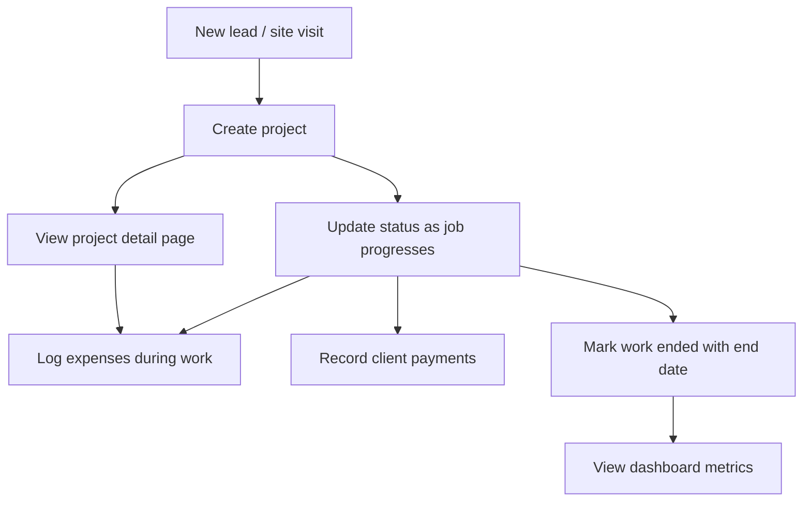

# Product Overview

## What is Skyline-App?

Skyline-App is an internal web tool for **Skyline Constructions** to manage construction jobs from initial site visit through completion. Staff can:

- Create and track **projects** with client details, quoted amounts, and a status pipeline
- Manage **clients** in a lightweight **CRM** (contact details, tags, source) for marketing
- Log **expenses** against projects
- Record **payments** received from clients
- View a **dashboard** with project counts, revenue metrics, and a 12-month income vs expenses chart
- Manage a **team**: owners grant or revoke access for members of their company

There is no custom backend server. The browser talks directly to Supabase (PostgreSQL via PostgREST), secured by Supabase Auth + Row Level Security.

---

## Target users

**Construction office staff** — project managers, accountants, or owners who need a lightweight CRM + ledger for active jobs.

**Access model (multi-tenant):**

- **super_admin** (the platform creator) — sees data across every company
- **owner** — created a company; sees only their company's data; grants/revokes member access and sets roles
- **member** — belongs to a company; sees that company's data only while their access is active

Login is required (Supabase Auth: email/password or Google). New users sign up, create a company (becoming its owner) or wait for an owner to grant access. Data isolation is enforced in the database by Row Level Security keyed on `company_id` and `auth.uid()` — not just in the UI.

---

## Core entities

### Project

A client construction job. Tracks:

- Identity: title, client name, location, work description
- Pipeline: status (site visit → quotation → work → completion or rejection)
- Progress: completion percentage, start/end dates
- Finances: total quoted amount, amount received (manual field), derived pending balance

### Expense

A cost incurred on a project (materials, labor, subcontractor, etc.). Always linked to one project via `project_id`.

### Payment

Money received from a client for a project. Always linked to one project via `project_id`. Stored separately from `projects.amount_received` (see known gap below).

---

## User journeys

1. **Onboard a job** — Projects page → fill Add New Project form → project appears in table
2. **Track progress** — Edit project → change status, dates, completion %
3. **Record costs** — Expenses page → select project, enter amount and date
4. **Record income** — Payments page or inline in Edit Project modal
5. **Review performance** — Dashboard → active count, completed revenue, cash-flow charts
6. **Drill into a job** — Click project title → detail page with financials and expense list

---

## In scope (current version)

- Multi-tenant auth with super_admin / owner / member roles (Supabase Auth + RLS)
- Company onboarding and team access management (grant/revoke, set role)
- CRM: full CRUD for clients with search and tags
- CRUD for projects (create, read, update — no delete)
- Create and list expenses
- Create and list payments
- Dashboard with metric cards and a 12-month income vs expenses chart
- Project detail view
- Status badges and color coding
- Responsive sidebar layout

---

## Out of scope (current version)

| Feature | Notes |
|---------|-------|
| Email invitations | Members self-sign-up; owner grants access |
| Marketing campaign sending | CRM stores/segments contacts only |
| Edit/delete expenses | Insert + list only |
| Edit/delete payments | Insert + list only |
| Invoicing / PDF export | Not implemented |
| File uploads (photos, contracts) | Not implemented |
| Scheduling / calendar | Not implemented |
| Notifications / email | Not implemented |
| Mobile native app | Web only |
| Multi-currency | INR (`en-IN`) display |
| Audit log | Not implemented |

---

## Production deployment

**Intended URL:** `https://skylineconstructions.in/app/`

The app is deployed as a static SPA under the `/app/` subpath. See [07-deployment.md](./07-deployment.md) for required Vite and router configuration.

---

## Known product gaps

Document these when replicating so you can choose to preserve or fix behavior:

1. **Payments vs `amount_received`** — Recording a payment inserts into `payments` but does not update `projects.amount_received`. Pending balances in the project table can become stale unless manually set at project creation. (An optional sync trigger is included but commented out in `docs/schema.sql`.)

2. **Profit label** — Dashboard "Profit (Year)" sums quoted amounts for completed jobs, not net margin (income minus expenses).

3. **Self role-change guard** — A database trigger prevents a non-super-admin from changing their own role/status/company; owners manage other members only.

4. **Super admin seeding** — The first super_admin must be promoted manually via SQL (see the seed note at the bottom of `docs/schema.sql`).

See [04-features-and-business-rules.md](./04-features-and-business-rules.md) for detailed behavior specs.
