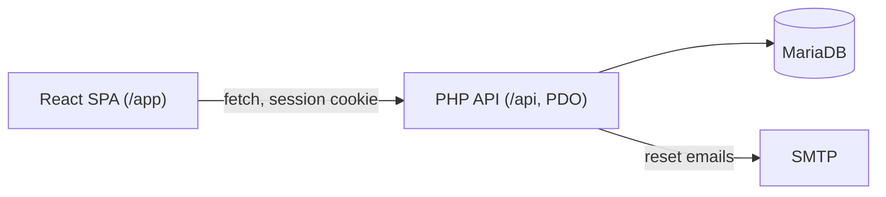
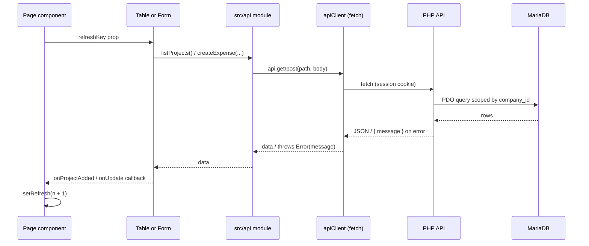

# Architecture

## System pattern

Skyline-App follows a **SPA + PHP API + MariaDB** architecture:



- **PHP API server** — the SPA never touches the database directly; all access goes through `fetch` calls to the PHP endpoints under `/api/`, wrapped in the `src/api/` data-access layer
- **No server-side rendering** — pure client-side React
- **Multi-tenant** — every row is scoped to a `company_id`; isolation is enforced in the PHP layer (each query is filtered by the caller's company). Roles: `super_admin`, `owner`, `member`
- **Auth** — email + password with PHP session cookies (`password_hash`/`password_verify`); password resets emailed via SMTP
- **Global auth state** — `AuthProvider` (React context) holds the session + profile/role; everything else stays local component state + parent `refresh` counters

---

## Repository layout

```
Skyline-App/
├── index.html              # HTML shell, Google Fonts
├── package.json            # Dependencies and scripts
├── vite.config.js          # Vite + React Compiler config
├── eslint.config.js        # ESLint flat config
├── .env                    # Frontend env (VITE_API_BASE, VITE_DEV_API_TARGET)
├── api/                    # PHP API: config, lib/, routes/, schema.sql, .env
├── docs/                   # This documentation pack
└── src/
    ├── main.jsx            # React entry point (wraps App in AuthProvider)
    ├── App.jsx             # Shell: auth/onboarding gate, sidebar + routes
    ├── App.css             # Layout, pages, forms, metrics
    ├── index.css           # Design tokens, global reset
    ├── constants.js        # Roles, project statuses, badge/chart helpers
    ├── apiClient.js        # fetch wrapper for the PHP API
    ├── api/                # Data-access layer (auth, profiles, clients, projects, expenses, payments, dashboard)
    ├── context/            # AuthProvider + useAuth hook
    ├── utils/              # format.js (currency + date helpers)
    ├── pages/              # Route-level views
    └── components/         # Reusable UI
```

---

## Source file map

### Entry and core

| File | Responsibility |
|------|----------------|
| `src/main.jsx` | Mount `<App />` in `#root` under `StrictMode`, wrapped in `<AuthProvider>`; import `index.css` |
| `src/App.jsx` | Auth + onboarding gate, `BrowserRouter`, role-aware sidebar, route definitions |
| `src/App.css` | App shell, page layouts, shared form/button/card classes |
| `src/index.css` | CSS custom properties (design tokens), typography reset |
| `src/constants.js` | `ROLES`, `PROJECT_STATUSES`, status badge/helpers, chart colors, month labels |
| `src/apiClient.js` | `fetch` wrapper for the PHP API (`/api`), session cookies, JSON errors |
| `src/context/AuthContext.jsx` + `auth.js` | `AuthProvider` (session + profile + role); `useAuth()` hook |
| `src/api/*.js` | Data-access layer — the only place that calls the PHP API |
| `src/utils/format.js` | `formatCurrency`, `formatCompactCurrency`, `formatDate`, date input helpers |
| `index.html` | Page title, favicon, Google Fonts CDN links |

### Pages (`src/pages/`)

| File | Route | Purpose |
|------|-------|---------|
| `Dashboard.jsx` | `/` | Metric cards + 12-month Income vs Expenses bar chart |
| `ProjectPage.jsx` | `/projects` | Add form, project table, edit modal |
| `ProjectDetailsPage.jsx` | `/projects/:id` | Single project detail + expenses |
| `ClientsPage.jsx` | `/clients` | CRM: client CRUD, search, tags |
| `ExpensePage.jsx` | `/expenses` | Add expense form + expense table |
| `Payments.jsx` | `/payments` | Add payment form + payment table |
| `TeamPage.jsx` | `/team` | Member management (owner/super_admin only) |
| `LoginPage.jsx` | — | Sign in / sign up (shown when logged out) |
| `OnboardingPage.jsx` | — | Create company (shown when logged in without a profile) |

### Components (`src/components/`)

| File | Used by | Purpose |
|------|---------|---------|
| `AddProjectForm.jsx` | ProjectPage | Insert new project |
| `ProjectTable.jsx` | ProjectPage | List all projects |
| `UpdateProjectForm.jsx` | ProjectPage | Modal: update project + inline payment |
| `AddExpenseForm.jsx` | ExpensePage | Insert expense |
| `ExpenseTable.jsx` | ExpensePage | List expenses with project status join |
| `AddPaymentForm.jsx` | Payments, UpdateProjectForm | Insert payment |
| `PaymentsTable.jsx` | Payments | List payments with project title join |

### Stylesheets

| File | Scope |
|------|-------|
| `AddProjectForm.css` | Add-project form grid |
| `ProjectTable.css` | Data tables, status badges, edit button (shared by expense/payment tables) |
| `UpdateProjectForm.css` | Modal overlay and update form |

---

## Routing

React Router v7 with `BrowserRouter`. **No `basename` configured today** (see deployment doc for `/app/` subpath).

| Path | Component | Nav link |
|------|-----------|----------|
| `/` | `Dashboard` | Dashboard |
| `/projects` | `ProjectPage` | Projects |
| `/projects/:id` | `ProjectDetailsPage` | — (linked from table) |
| `/clients` | `ClientsPage` | Clients |
| `/expenses` | `ExpensePage` | Expenses |
| `/payments` | `Payments` | Payments |
| `/team` | `TeamPage` | Team (owner / super_admin only) |

Navigation uses `NavLink` with active class styling. Layout is persistent: left sidebar + scrollable main content. Before routes render, `App` gates on auth state: logged out -> `LoginPage`; logged in without a profile -> `OnboardingPage`.

---

## Data flow



Components never call the API directly — they import functions from `src/api/`, which use the `src/apiClient.js` fetch wrapper. The session cookie is sent automatically (`credentials: 'include'`), and each PHP endpoint scopes its queries to the caller's `company_id`.

**Refresh pattern:** Parent pages hold `const [refresh, setRefresh] = useState(0)`. After a successful create or update, they call `setRefresh(prev => prev + 1)`. Child tables pass `refreshKey={refresh}` into `useEffect` dependencies to re-fetch.

**No caching layer** — every navigation or refresh triggers fresh Supabase queries.

---

## API usage summary

| Table | SELECT | INSERT | UPDATE | DELETE | api module | endpoints |
|-------|--------|--------|--------|--------|------------|-----------|
| `companies` | onboarding/profile | OnboardingPage | owner | — | `profiles.js` | `POST /companies` |
| `profiles` | AuthContext, TeamPage | sign-up / onboarding | TeamPage | — | `profiles.js` | `GET /profile`, `GET/PATCH /members` |
| `clients` | ClientsPage, AddProjectForm | AddClientForm | AddClientForm | ClientsPage | `clients.js` | `/clients` |
| `projects` | All pages | AddProjectForm | UpdateProjectForm | — | `projects.js` | `/projects` |
| `expenses` | Dashboard, ExpenseTable, ProjectDetails | AddExpenseForm | — | — | `expenses.js` | `/expenses` |
| `payments` | Dashboard, PaymentsTable | AddPaymentForm | — | — | `payments.js` | `/payments` |

All access is scoped in the PHP layer to the caller's `company_id` (super_admin sees all). `company_id` is stamped server-side on INSERT, so the client never sends it. Full schema: [api/schema.sql](../api/schema.sql).

---

## Dependencies

### Runtime

| Package | Version | Purpose |
|---------|---------|---------|
| `react` / `react-dom` | ^19.2.6 | UI framework |
| `react-router-dom` | ^7.17.0 | Client-side routing |
| `recharts` | ^3.8.1 | Dashboard bar charts |
| `lucide-react` | ^1.18.0 | SVG icons |

Backend has no Composer dependencies — the PHP API uses only built-in extensions (`pdo_mysql`, `openssl` for SMTP TLS, `json`).

### Development

| Package | Purpose |
|---------|---------|
| `vite` ^8.0.12 | Dev server and production bundler |
| `@vitejs/plugin-react` | React/JSX support |
| `@rolldown/plugin-babel` + `babel-plugin-react-compiler` | React Compiler |
| `eslint` + plugins | Linting |

---

## Build configuration

`vite.config.js`:

```js
import { defineConfig } from 'vite'
import react, { reactCompilerPreset } from '@vitejs/plugin-react'
import babel from '@rolldown/plugin-babel'

export default defineConfig({
  plugins: [
    react(),
    babel({ presets: [reactCompilerPreset()] })
  ],
})
```

**Note:** React Compiler is enabled. This may affect dev/build performance.

**Scripts:**

| Command | Action |
|---------|--------|
| `npm run dev` | Start Vite dev server (default port 5173) |
| `npm run build` | Production build to `dist/` |
| `npm run preview` | Serve production build locally |
| `npm run lint` | Run ESLint |

---

## Environment variables

**Frontend (`.env`, optional, `VITE_`-prefixed, inlined at build time):**

| Variable | Required | Used in |
|----------|----------|---------|
| `VITE_API_BASE` | No (default `/api`) | `src/apiClient.js` |
| `VITE_DEV_API_TARGET` | No (dev only) | `vite.config.js` proxy |

**Backend (`api/.env`):**

| Variable | Required | Purpose |
|----------|----------|---------|
| `DB_HOST` / `DB_PORT` / `DB_NAME` / `DB_USER` / `DB_PASS` | Yes | MariaDB connection |
| `APP_URL` | Yes | Base URL for password-reset links |
| `SMTP_HOST` / `SMTP_PORT` / `SMTP_USER` / `SMTP_PASS` / `SMTP_SECURE` | No | SMTP for reset emails (falls back to `mail()`) |
| `MAIL_FROM` / `MAIL_FROM_NAME` | No | From address for emails |

---

## What is intentionally absent

- TypeScript
- Unit or integration tests
- CI/CD configuration
- ORM / query builder (the PHP API uses plain PDO + prepared statements)
- Email invitations (members self-sign-up, then an owner grants access)
- Email verification on signup (only password-reset emails are implemented)
- Error boundary components
- Service workers / PWA
