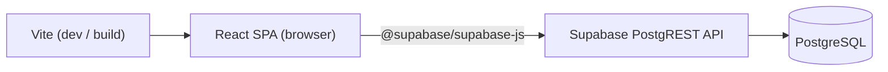
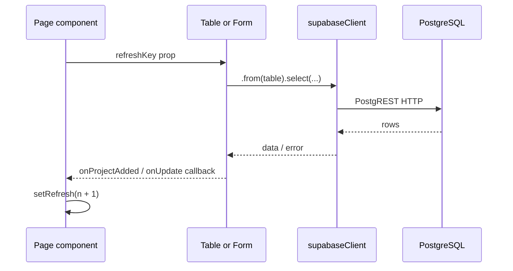

# Architecture

## System pattern

Skyline-App follows a **static SPA + BaaS** architecture:



- **No custom API server** — all database access is client-side via the Supabase JavaScript client
- **No server-side rendering** — pure client-side React
- **No global state library** — local component state + parent `refresh` counters

---

## Repository layout

```
Skyline-App/
├── index.html              # HTML shell, Google Fonts
├── package.json            # Dependencies and scripts
├── vite.config.js          # Vite + React Compiler config
├── eslint.config.js        # ESLint flat config
├── .env                    # VITE_SUPABASE_URL, VITE_SUPABASE_ANON_KEY
├── docs/                   # This documentation pack
└── src/
    ├── main.jsx            # React entry point
    ├── App.jsx             # Shell: sidebar + routes
    ├── App.css             # Layout, pages, forms, metrics
    ├── index.css           # Design tokens, global reset
    ├── supabaseClient.js   # Supabase client singleton
    ├── pages/              # Route-level views (5 files)
    └── components/         # Reusable UI (7 files + 3 CSS)
```

---

## Source file map

### Entry and core

| File | Responsibility |
|------|----------------|
| `src/main.jsx` | Mount `<App />` in `#root` under `StrictMode`; import `index.css` |
| `src/App.jsx` | `BrowserRouter`, sidebar navigation, route definitions |
| `src/App.css` | App shell, page layouts, shared form/button/card classes |
| `src/index.css` | CSS custom properties (design tokens), typography reset |
| `src/supabaseClient.js` | `createClient(VITE_SUPABASE_URL, VITE_SUPABASE_ANON_KEY)` |
| `index.html` | Page title, favicon, Google Fonts CDN links |

### Pages (`src/pages/`)

| File | Route | Purpose |
|------|-------|---------|
| `Dashboard.jsx` | `/` | Metric cards + Recharts bar charts |
| `ProjectPage.jsx` | `/projects` | Add form, project table, edit modal |
| `ProjectDetailsPage.jsx` | `/projects/:id` | Single project detail + expenses |
| `ExpensePage.jsx` | `/expenses` | Add expense form + expense table |
| `Payments.jsx` | `/payments` | Add payment form + payment table |

### Components (`src/components/`)

| File | Used by | Purpose |
|------|---------|---------|
| `AddProjectForm.jsx` | ProjectPage | Insert new project |
| `ProjectTable.jsx` | ProjectPage | List all projects |
| `UpdateProjectForm.jsx` | ProjectPage | Modal: update project + inline payment |
| `AddExpenseForm.jsx` | ExpensePage | Insert expense |
| `ExpenseTable.jsx` | ExpensePage | List expenses with project status join |
| `AddPaymentForm.jsx` | Payments, UpdateProjectForm | Insert payment |
| `PaymentsTable.jsx` | Payments | List payments with project title join |

### Stylesheets

| File | Scope |
|------|-------|
| `AddProjectForm.css` | Add-project form grid |
| `ProjectTable.css` | Data tables, status badges, edit button (shared by expense/payment tables) |
| `UpdateProjectForm.css` | Modal overlay and update form |

---

## Routing

React Router v7 with `BrowserRouter`. **No `basename` configured today** (see deployment doc for `/app/` subpath).

| Path | Component | Nav link |
|------|-----------|----------|
| `/` | `Dashboard` | Dashboard |
| `/projects` | `ProjectPage` | Projects |
| `/projects/:id` | `ProjectDetailsPage` | — (linked from table) |
| `/expenses` | `ExpensePage` | Expenses |
| `/payments` | `Payments` | Payments |

Navigation uses `NavLink` with active class styling. Layout is persistent: left sidebar + scrollable main content.

---

## Data flow



**Refresh pattern:** Parent pages hold `const [refresh, setRefresh] = useState(0)`. After a successful create or update, they call `setRefresh(prev => prev + 1)`. Child tables pass `refreshKey={refresh}` into `useEffect` dependencies to re-fetch.

**No caching layer** — every navigation or refresh triggers fresh Supabase queries.

---

## Supabase usage summary

| Table | SELECT | INSERT | UPDATE | DELETE |
|-------|--------|--------|--------|--------|
| `projects` | All pages | AddProjectForm | UpdateProjectForm | — |
| `expenses` | Dashboard, ExpenseTable, ProjectDetails | AddExpenseForm | — | — |
| `payments` | Dashboard, PaymentsTable | AddPaymentForm | — | — |

**PostgREST embeds (joins):**

```js
// ExpenseTable
.from('expenses').select('amount, description, expense_date, projects(status)')

// PaymentsTable
.from('payments').select('*, projects(project_title)')
```

Full schema: [03-database-schema.md](./03-database-schema.md)

---

## Dependencies

### Runtime

| Package | Version | Purpose |
|---------|---------|---------|
| `react` / `react-dom` | ^19.2.6 | UI framework |
| `react-router-dom` | ^7.17.0 | Client-side routing |
| `@supabase/supabase-js` | ^2.108.1 | Database client |
| `recharts` | ^3.8.1 | Dashboard bar charts |
| `lucide-react` | ^1.18.0 | SVG icons |

### Development

| Package | Purpose |
|---------|---------|
| `vite` ^8.0.12 | Dev server and production bundler |
| `@vitejs/plugin-react` | React/JSX support |
| `@rolldown/plugin-babel` + `babel-plugin-react-compiler` | React Compiler |
| `eslint` + plugins | Linting |

---

## Build configuration

`vite.config.js`:

```js
import { defineConfig } from 'vite'
import react, { reactCompilerPreset } from '@vitejs/plugin-react'
import babel from '@rolldown/plugin-babel'

export default defineConfig({
  plugins: [
    react(),
    babel({ presets: [reactCompilerPreset()] })
  ],
})
```

**Note:** React Compiler is enabled. This may affect dev/build performance.

**Scripts:**

| Command | Action |
|---------|--------|
| `npm run dev` | Start Vite dev server (default port 5173) |
| `npm run build` | Production build to `dist/` |
| `npm run preview` | Serve production build locally |
| `npm run lint` | Run ESLint |

---

## Environment variables

| Variable | Required | Used in |
|----------|----------|---------|
| `VITE_SUPABASE_URL` | Yes | `supabaseClient.js` |
| `VITE_SUPABASE_ANON_KEY` | Yes | `supabaseClient.js` |

Vite exposes only variables prefixed with `VITE_`. They are inlined at build time.

---

## What is intentionally absent

- TypeScript
- Unit or integration tests
- CI/CD configuration
- Supabase migration files in repo (schema documented in `docs/schema.sql`)
- Authentication middleware
- Error boundary components
- Service workers / PWA
