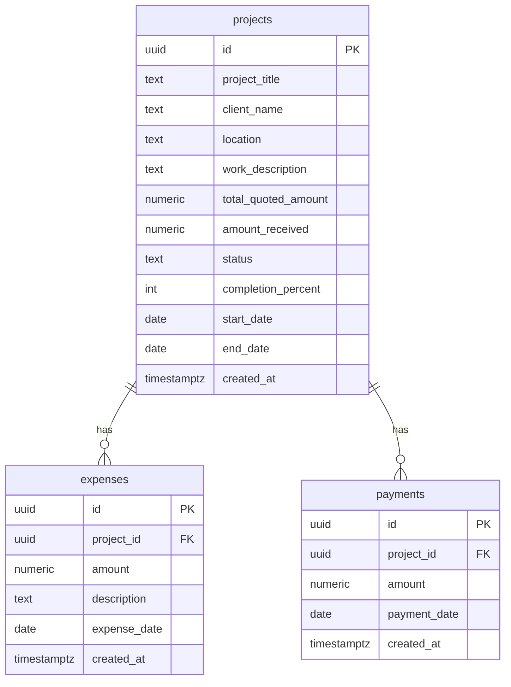

# Database Schema

The database lives in **Supabase (PostgreSQL)**. There are no migration files in the application repository; this document and [`schema.sql`](./schema.sql) serve as the canonical schema seed for replication.

---

## Entity relationship diagram



---

## Table: `projects`

| Column | Type | Nullable | Default | Notes |
|--------|------|----------|---------|-------|
| `id` | `uuid` | NO | `gen_random_uuid()` | Primary key |
| `project_title` | `text` | NO | — | Display name |
| `client_name` | `text` | YES | — | |
| `location` | `text` | YES | — | Job site or address |
| `work_description` | `text` | YES | — | Free-text scope |
| `total_quoted_amount` | `numeric(12,2)` | YES | `0` | Quoted contract value |
| `amount_received` | `numeric(12,2)` | YES | `0` | **Set manually on create only in app** |
| `status` | `text` | NO | `'site visit requested'` | See status workflow |
| `completion_percent` | `integer` | YES | `0` | 0–100 |
| `start_date` | `date` | YES | — | |
| `end_date` | `date` | YES | — | Required for completed jobs in UI |
| `created_at` | `timestamptz` | YES | `now()` | Recommended |

### Status values (as used in app)

| Status | Meaning |
|--------|---------|
| `site visit requested` | Default on create |
| `site visit done` | Site assessed |
| `quotation sent` | Quote delivered to client |
| `work started` | Active construction |
| `work ended` | Job complete (terminal) |
| `rejected` | Lost / declined (terminal) |
| `Completed` | **Update form only** — inconsistent with dashboard; avoid in replication v2 |

---

## Table: `expenses`

| Column | Type | Nullable | Default | Notes |
|--------|------|----------|---------|-------|
| `id` | `uuid` | NO | `gen_random_uuid()` | Primary key |
| `project_id` | `uuid` | NO | — | FK → `projects.id` |
| `amount` | `numeric(12,2)` | NO | — | Expense amount |
| `description` | `text` | YES | — | What the expense was for |
| `expense_date` | `date` | NO | — | When expense occurred |
| `created_at` | `timestamptz` | YES | `now()` | Recommended |

---

## Table: `payments`

| Column | Type | Nullable | Default | Notes |
|--------|------|----------|---------|-------|
| `id` | `uuid` | NO | `gen_random_uuid()` | Primary key |
| `project_id` | `uuid` | NO | — | FK → `projects.id` |
| `amount` | `numeric(12,2)` | NO | — | Payment received |
| `payment_date` | `date` | NO | — | When payment was received |
| `created_at` | `timestamptz` | YES | `now()` | Recommended |

---

## Indexes (recommended)

```sql
CREATE INDEX idx_expenses_project_id ON expenses(project_id);
CREATE INDEX idx_expenses_expense_date ON expenses(expense_date DESC);
CREATE INDEX idx_payments_project_id ON payments(project_id);
CREATE INDEX idx_payments_payment_date ON payments(payment_date DESC);
CREATE INDEX idx_projects_status ON projects(status);
CREATE INDEX idx_projects_start_date ON projects(start_date DESC);
```

---

## Row Level Security (RLS)

The current app has **no authentication**. For replication to match current behavior, enable RLS and add permissive anon policies:

```sql
ALTER TABLE projects ENABLE ROW LEVEL SECURITY;
ALTER TABLE expenses ENABLE ROW LEVEL SECURITY;
ALTER TABLE payments ENABLE ROW LEVEL SECURITY;

-- WARNING: These policies allow unrestricted public access.
-- Replace with auth.uid()-based policies before any public deployment.

CREATE POLICY "anon_all_projects" ON projects
  FOR ALL TO anon USING (true) WITH CHECK (true);

CREATE POLICY "anon_all_expenses" ON expenses
  FOR ALL TO anon USING (true) WITH CHECK (true);

CREATE POLICY "anon_all_payments" ON payments
  FOR ALL TO anon USING (true) WITH CHECK (true);
```

**Replication v2 recommendation:** Integrate Supabase Auth and scope policies to authenticated users or organization IDs.

---

## Optional trigger: sync `amount_received` on payment insert

The app does **not** update `projects.amount_received` when payments are recorded. For replication v2, add this trigger:

```sql
CREATE OR REPLACE FUNCTION sync_amount_received_on_payment()
RETURNS TRIGGER AS $$
BEGIN
  UPDATE projects
  SET amount_received = COALESCE(amount_received, 0) + NEW.amount
  WHERE id = NEW.project_id;
  RETURN NEW;
END;
$$ LANGUAGE plpgsql SECURITY DEFINER;

CREATE TRIGGER trg_sync_amount_received
  AFTER INSERT ON payments
  FOR EACH ROW
  EXECUTE FUNCTION sync_amount_received_on_payment();
```

If you add this trigger, pending balances in the UI will stay accurate without app code changes.

---

## PostgREST relationship requirements

For embed queries to work, Supabase must detect foreign keys:

- `expenses.project_id` → `projects.id`
- `payments.project_id` → `projects.id`

Ensure foreign keys are created as in [`schema.sql`](./schema.sql).

---

## Application operations reference

### INSERT into `projects`

```js
{
  project_title, client_name, location, work_description,
  total_quoted_amount, amount_received, status, completion_percent,
  start_date,  // null if empty string
  end_date     // null if empty string
}
```

### UPDATE `projects`

```js
{
  status, completion_percent, start_date, end_date, total_quoted_amount
}
// end_date set to null unless status is 'work ended' or 'Completed'
```

### INSERT into `expenses`

```js
{ project_id, amount, description, expense_date }
```

### INSERT into `payments`

```js
{ project_id, amount, payment_date }
// amount may be string from HTML input; Postgres coerces to numeric
```

### SELECT patterns

| Query | Used in |
|-------|---------|
| `projects.select('*').order('start_date', { ascending: false })` | ProjectTable |
| `projects.select('*').eq('id', id).single()` | ProjectDetailsPage |
| `projects.select('id, project_title')` | Expense/payment form dropdowns |
| `expenses.select('*')` | Dashboard |
| `expenses.select('..., projects(status)')` | ExpenseTable |
| `payments.select('*')` | Dashboard |
| `payments.select('*, projects(project_title)')` | PaymentsTable |
| Count queries with status filters | Dashboard |

---

## Executable migration

Run [`schema.sql`](./schema.sql) in the Supabase SQL Editor to create all tables, indexes, RLS policies, and the optional payment sync trigger.
