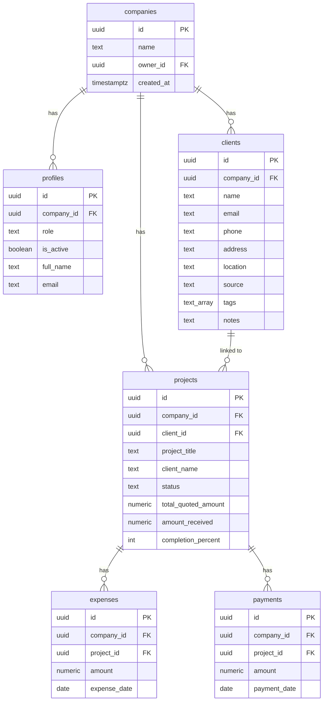

# Database Schema

The database lives in **Supabase (PostgreSQL)** and is **multi-tenant**. [`schema.sql`](./schema.sql) is the canonical, idempotent build script (it drops and recreates everything). This document describes the model.

Every business row is scoped to a `company_id`. Row Level Security (RLS) isolates each company's data using the signed-in user's `auth.uid()`.

---

## Entity relationship diagram



---

## Tenancy tables

### `companies`
One row per tenant. `owner_id` references the auth user who created it.

### `profiles`
One row per auth user (`id` = `auth.users.id`).

| Column | Type | Notes |
|--------|------|-------|
| `id` | `uuid` PK | = `auth.users.id` |
| `company_id` | `uuid` | Tenant; `NULL` allowed for a super_admin |
| `role` | `text` | `super_admin` \| `owner` \| `member` |
| `is_active` | `boolean` | Owner's grant/revoke switch; revoked = no data access |
| `full_name`, `email` | `text` | Display |

---

## Business tables

`clients`, `projects`, `expenses`, `payments` each carry a `company_id` (auto-stamped on insert — see triggers). `projects.client_id` optionally links a project to a CRM client; `client_name` is still stored for display.

### Project status values (canonical)

`site visit requested`, `site visit done`, `quotation sent`, `work started`, `work completed`, `completed`, `rejected` — enforced by a `CHECK` constraint. (`completed` is the final/archived state; `work completed` means work delivered.)

---

## Access helper functions

`SECURITY DEFINER` functions read `profiles` without tripping RLS recursion:

- `current_company_id()` — caller's `company_id`
- `is_super_admin()` — caller has the super_admin role
- `is_company_owner()` — caller has the owner role
- `is_active_member()` — caller is active and belongs to a company

---

## Row Level Security

RLS is enabled on every table; policies are granted to the `authenticated` role. The core predicate on business tables:

```sql
USING ( is_super_admin() OR (is_active_member() AND company_id = current_company_id()) )
```

- super_admin bypasses the company filter (sees all)
- owner/member match only their own `company_id`
- a revoked member (`is_active = false`) matches nothing

`profiles` allows reading your own row, your company's rows, or all (super_admin); owners may update members in their company. `companies` is readable/updatable by its owner (and super_admin).

---

## Triggers

- `set_company_id()` — `BEFORE INSERT` on `clients`/`projects`/`expenses`/`payments`; stamps `company_id = current_company_id()` so the client never sends it.
- `guard_profile_self_update()` — `BEFORE UPDATE` on `profiles`; blocks a non-super-admin from changing their own `role`, `is_active`, or `company_id` (prevents self-escalation).

---

## Onboarding RPC

```sql
create_company_and_join(p_name text, p_full_name text) returns uuid
```

`SECURITY DEFINER` function that atomically creates a company and an `owner` profile for the caller, sidestepping the RLS chicken-and-egg of inserting a company before a profile exists. Called from `OnboardingPage` via `supabase.rpc(...)`.

---

## Seeding the super admin

Sign up once, then promote that user via SQL (see the note at the bottom of [`schema.sql`](./schema.sql)):

```sql
UPDATE profiles SET role = 'super_admin', is_active = true
WHERE id = (SELECT id FROM auth.users WHERE email = 'you@example.com');
```

---

## Optional: sync `amount_received` on payment insert

The app does not update `projects.amount_received` when a payment is recorded. A commented trigger in earlier versions can be re-added if you want pending balances to update automatically; current behavior keeps `amount_received` as a manual field.

---

## Executable migration

Run [`schema.sql`](./schema.sql) in the Supabase SQL Editor. It drops existing tables (wiping data), then recreates tables, indexes, helper functions, the onboarding RPC, triggers, and all RLS policies.
