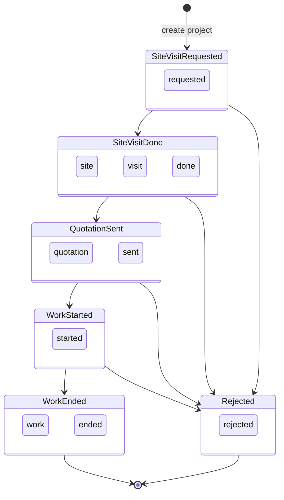

# Features and Business Rules

Per-page specifications and calculation logic for replication.

---

## Operations matrix

| Entity | Create | Read | Update | Delete |
|--------|--------|------|--------|--------|
| projects | Yes | Yes | Yes (modal) | No |
| expenses | Yes | Yes | No | No |
| payments | Yes | Yes | No | No |

---

## Status workflow



### Canonical status list (add form)

1. `site visit requested` — default
2. `site visit done`
3. `quotation sent`
4. `work started`
5. `work ended`
6. `rejected`

### Update form additional status

- `Completed` — appears only in `UpdateProjectForm`; **not** recognized by dashboard or add form. **Recommendation for replication:** remove and use `work ended` only.

### Status badge CSS classes

| Condition | CSS class |
|-----------|-----------|
| Contains `"site visit"` | `status-badge--site-visit` (blue) |
| `quotation sent` | `status-badge--quotation` (amber) |
| `work started` | `status-badge--work-started` (green) |
| `work ended` | `status-badge--work-ended` (gray) |
| `rejected` | `status-badge--rejected` (red) |
| Other | `status-badge--default` (purple) |

---

## Dashboard (`/`)

**Source:** `src/pages/Dashboard.jsx`

### Data fetched (parallel)

1. Active project count — head count, `status NOT IN ('work ended', 'rejected')`
2. Total project count — head count, `status != 'rejected'`
3. All projects (`select *`)
4. All expenses (`select *`)
5. All payments (`select *`)

### Metric cards

| Card | Calculation |
|------|-------------|
| **Active Projects** | Count from query #1 |
| **Total Projects** | Count from query #2 |
| **Profit (Month)** | Sum of `total_quoted_amount` where `status === 'work ended'` AND `end_date >= first day of current month` |
| **Profit (Year)** | Same but `end_date >= first day of current year` |

**Important:** "Profit" is **completed-job quoted revenue**, not net profit. It does not subtract expenses or use the payments table.

### Computed but not displayed

These values are calculated in state but never rendered:

- `metrics.incomeMonth` — sum of `payments.amount` in current month
- `metrics.expensesMonth` — sum of `expenses.amount` in current month

### Cash flow charts (Recharts bar chart)

**Month chart** — current calendar month:

- **Income bar:** sum `payments.amount` where `payment_date >= firstDayOfMonth`
- **Expenses bar:** sum `expenses.amount` where `expense_date >= firstDayOfMonth`

**Year chart** — current calendar year:

- Same logic with `firstDayOfYear`

Chart colors: Income `#10b981`, Expenses `#f87171`.

---

## Projects (`/projects`)

**Source:** `src/pages/ProjectPage.jsx`

Layout: page header → Add Project form → Project table → Edit modal (conditional).

### Add New Project (`AddProjectForm`)

**Required fields:** `project_title`, `client_name`, `status`

**Fields:**

| Field | Type | Default |
|-------|------|---------|
| project_title | text | `''` |
| client_name | text | `''` |
| location | text | `''` |
| total_quoted_amount | number | `0` |
| amount_received | number | `0` |
| status | select | `site visit requested` |
| start_date | date | `''` → stored as `null` |
| end_date | date | `''` → stored as `null` |
| work_description | textarea | `''` |
| completion_percent | number | `0` |

**Business rules on submit:**

- If `status === 'work ended'`, set `completion_percent = 100` regardless of form value
- Empty date strings → `null`
- On success: reset form, show success message, call `onProjectAdded()`

**Error handling:** Displays Supabase error message in UI. Only form with user-visible errors.

### Project table (`ProjectTable`)

- Fetches all projects ordered by `start_date DESC`
- Shows loading spinner while fetching

**Columns:** Status, Title (link to detail), Client, Location, Total, Received, Pending, Dates, Actions

**Pending calculation:**

```
pending = total_quoted_amount - amount_received
```

- Pending > 0: amber/warning color
- Pending = 0: green color

**Edit button:** Opens `UpdateProjectForm` modal with selected project.

### Update project modal (`UpdateProjectForm`)

**Editable fields:** status, completion_percent, start_date, end_date, total_quoted_amount

**Conditional UI:**

| Field | Visible when status is |
|-------|------------------------|
| Completion % | `work started`, `work ended`, `Completed` |
| End date | `work ended`, `Completed` |

**Business rules on submit:**

- `end_date` saved only if status is `work ended` or `Completed`; otherwise set to `null`
- `completion_percent` and `total_quoted_amount` coerced with `Number()`
- Empty `start_date` → `null`

**Embedded payment form:** `AddPaymentForm` with `defaultProjectId={project.id}` allows recording a payment without leaving the modal. Payment insert does not update `amount_received`.

**On success:** calls `onUpdate()` then `onClose()`.

---

## Project details (`/projects/:id`)

**Source:** `src/pages/ProjectDetailsPage.jsx`

### Data fetched

1. Project: `projects.select('*').eq('id', id).single()`
2. Expenses: `expenses.select('*').eq('project_id', id)`

### Display

- Back link to `/projects`
- Title + status badge
- Subtitle: client name · location
- Two detail cards: Project Details, Financials
- Expense table: description, date, amount

**Financial calculations:**

```
pending = total_quoted_amount - amount_received
totalExpenses = sum(expenses.amount)
```

### Known gap

If project ID is invalid or not found, component shows loading spinner indefinitely. No 404 or error message.

---

## Expenses (`/expenses`)

**Source:** `src/pages/ExpensePage.jsx`

Two-column layout: form (left) + table (right).

### Log New Expense (`AddExpenseForm`)

**On mount:** fetches `projects.select('id, project_title')` for dropdown.

**Fields:**

| Field | Required | Default |
|-------|----------|---------|
| project_id | Yes | `''` |
| amount | Yes | `''` |
| description | No | `''` |
| date (expense_date) | Yes | Today (ISO date) |

**Insert:**

```js
{ project_id, amount: Number(amount), description, expense_date: date }
```

**On success:** reset form, call `onExpenseAdded()`. Errors logged to console only.

### Recent Expenses table (`ExpenseTable`)

Query:

```js
expenses.select('amount, description, expense_date, projects(status)')
  .order('expense_date', { ascending: false })
```

**Columns:** Date, Project Status, Description, Amount

**Note:** Shows linked project **status**, not project title. Uses array index as React key (not ideal for replication v2).

---

## Payments (`/payments`)

**Source:** `src/pages/Payments.jsx`

Two-column layout: form (left) + table (right).

Uses `refresh` state pattern — incrementing after payment triggers table re-fetch.

### Record Payment (`AddPaymentForm`)

**Props:**

| Prop | Purpose |
|------|---------|
| `onPaymentAdded` | Callback after successful insert |
| `defaultProjectId` | Pre-select project (used in update modal); hides project dropdown |

**Fields:** project_id (unless defaultProjectId), amount, payment_date (defaults to today)

**Insert:**

```js
payments.insert([{ project_id, amount, payment_date }])
```

**Data integrity gap:** Does **not** update `projects.amount_received`. Pending balances in project table become inaccurate over time.

### Payment History table (`PaymentsTable`)

Query:

```js
payments.select('*, projects(project_title)').order('payment_date', { ascending: false })
```

**Columns:** Date, Project, Amount

---

## Shared patterns

### Date handling

- Form date inputs use `YYYY-MM-DD` strings
- Dashboard filters use `new Date()` comparisons against `firstDayOfMonth` / `firstDayOfYear`
- Display formatting: `toLocaleDateString('en-US', { month: 'short', day: 'numeric', year: 'numeric' })`

### Currency

All amounts displayed with `$` prefix and `toLocaleString()` or `toFixed(2)`. No locale configuration.

### Refresh pattern

```jsx
const [refresh, setRefresh] = useState(0);
// After mutation:
setRefresh(prev => prev + 1);
// Child:
useEffect(() => { fetchData(); }, [refreshKey]);
```

---

## Replication recommendations (v2 fixes)

| Issue | Recommended fix |
|-------|-----------------|
| Payment / amount_received desync | Add DB trigger (see schema doc) or update in app after payment insert |
| `Completed` status | Remove; use `work ended` only |
| Misleading "Profit" label | Rename to "Completed Revenue" or compute true margin |
| Missing error states | Add 404 on detail page; show form errors everywhere |
| No auth | Add Supabase Auth + scoped RLS |
| Expense table key | Use `exp.id` instead of array index |
